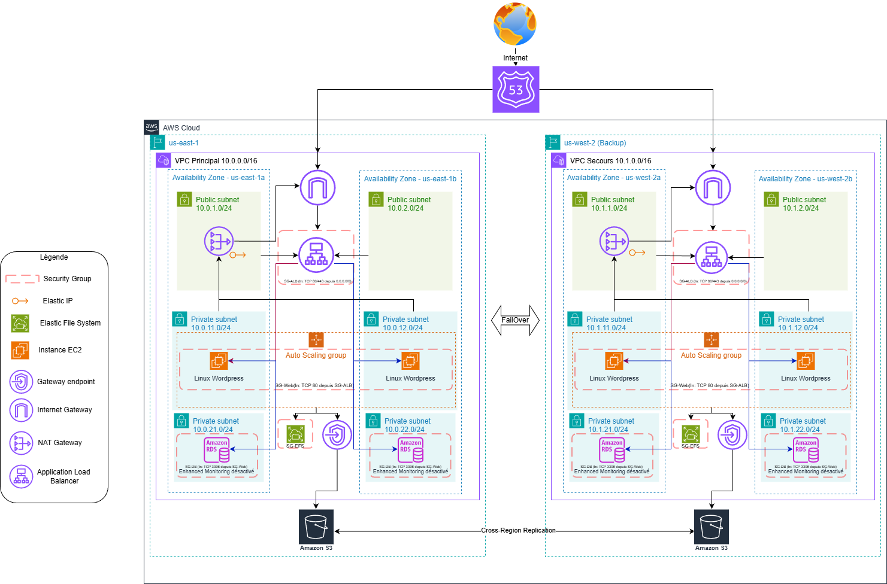

# Projet Connect M1 - Mastère Expert Cloud, Sécurité et Infrastructure M1

### TABLE DES MATIÈRES

- I. Récapitulatif du sujet
- II. Présentation de l'infrastructure & schéma
- III. Méthode de déploiement employée
- IV. Déploiement de l'infrastructure
- V. Test de fonctionnement
- VI. Test de failover


### I. Récapitulatif du sujet

Notre équipe a sélectionné le sujet "3-Tiers classique et haute disponibilité", constistant en la conception et le déploiement via IaC d'une infrastructure résiliante hébergeant un site de E-Commerce sous Wordpress.

Plusieurs contraintes/obligations ont pu être identifiées sur ce sujet :

- Obligation de déployer Wordpress sur des instances EC2 dans des containers Docker (la contrainte Docker a été annulée par le formateur peu de temps après le début du projet).
- Les médias Wordpress doivent être externalisés des serveurs web sur S3.
- La base de données doit être externalisée des serveurs web sur un service AWS dédié.
- VPC sur-mesure avec au moins 2 zones de disponibilité.
- Découpage en sous-réseaux strict.
- Security Groups configurés selon le principe du moindre privilège.
- Les instances EC2 doivent pouvoir supporter une charge irrégulière plus ou moins importante, être scalable et hautement disponible.
- Le bucket S3 doit être sécurisé et configuré pour que les instances EC2 puissent y déposer des fichiers.
- Une région de secours sur laquelle le site web doit pouvoir être basculée si incident sur la région principale.
- AUCUNE INTERRUPTION DE SERVICE NE SERA TOLÉRÉE.


### II. Présentation de l'infrastructure & schéma



Notre infrastructure hautement disponible se compose de telle sorte :

- 1 zone publique hébergée sur Route 53 avec le nom de domaine ynov-infram1-grp1.com pour la gestion du failover du site web en cas d'incident sur la zone principale (bascule automatique).
- 2 régions, us-east-1 et us-west-2, strictement identiques.
- 2 AZ par région.
- 1 sous-réseau publique, 2 sous-réseaux privés par AZ (un pour les instances EC2, un autre pour la base de données).
- 1 ALB par région permettant la répartition de charge et la surveillance des instances EC2.
- 1 ASG par région permettant le déploiement automatisé et scalable selon la charge d'instances EC2 Linux avec Docker Wordpress. 2 instances minimum, 4 instances maximum.
- 1 NAT Gateway par région afin de fournir un accès Internet aux instances EC2 pour leur mise à disposition (configuration Docker) ainsi que 1 Internet Gateway par région.
- 1 EFS principal répliqué sur la région secondaire sur lequel toutes les instances EC2 se connecte. Ce partage contient tous les fichiers de Wordpress.
- 1 S3 principal répliqué sur la région secondaire sur lequel peuvent être déposés les médias envoyés sur Wordpress.
- 1 RDS principal sous MySQL répliqué sur la région secondaire sur lequel Wordpress se connecte.

Pour la partie Sécurité, nous avons 4 Security Groups par région :

- SG-ALB, autorisant un flux entrant depuis 0.0.0.0/0 sur les ports HTTP 80 et HTTPS 443.
- SG-WEB, autorisant un flux entrant depuis SG-ALB sur le port HTTP 80, ainsi qu'un flux sortant vers 0.0.0.0/0 sur le port HTTPS 443 + flux sortant vers SG-DB sur le port SQL 3306 + flux sortant vers SG-EFS sur le port NFS 2049.
- SG-EFS, autorisant un flux entrant depuis SG-WEB sur le port NFS 2049.
- SG-DB, autorisant un flux entrant depuis SG-WEB sur le port SQL 3306

Le bucket S3 est configuré pour autoriser en lecture l'accès aux fichiers depuis Internet afin que les utilisateurs du site web puissent afficher les médias Wordpress.


### III. Méthode de déploiement employée

L'infrastructure est entièrement décrite en code (Infrastructure as Code) avec AWS CDK en Python. Le CDK synthétise des templates CloudFormation, déployés automatiquement par un pipeline GitLab CI/CD. Aucune ressource n'est créée à la main dans la console : tout passe par le code (infra/) et le pipeline, sinon on crée un drift qui sera écrasé au prochain déploiement. GitLab est la source de vérité du déploiement ; GitHub est un miroir push (collaboration / visibilité).

#### 1. Architecture du code CDK (dossier infra/)

```
infra/
├── app.py                  # point d'entrée CDK : instancie les 2 stacks régionaux
├── cdk.json                # config CDK (app = "python app.py")
├── requirements.txt        # dépendances (aws-cdk-lib, constructs)
├── stacks/nested/
│   ├── parent.py           # stack PARENT par région : orchestre les nested stacks
│   ├── vpc.py              # VPC, subnets (public/web/db), IGW, NAT, endpoint S3
│   ├── sg.py               # Security Groups (moindre privilège)
│   ├── rds.py              # base RDS MySQL (master password géré par RDS)
│   ├── efs.py              # EFS : création + réplication OU montage d'un replica
│   ├── alb.py              # Application Load Balancer + target group + listener
│   ├── asg.py              # Launch Template + Auto Scaling Group + scaling policy
│   ├── s3.py               # buckets S3 (CRR + bucket policy publique en lecture)
│   └── route53.py          # hosted zone + records Failover + health checks
└── script/user_data.sh     # script de boot des EC2 (Docker + WordPress)
```

**app.py — le point d'entrée :**

- Crée l'App CDK.
- Lit les variables d'environnement (AWS_ACCOUNT_ID, DB_PASSWORD) et les contextes passés par le pipeline en ligne de commande (-c clé=valeur) : alb_dns_secondary (Route53), replica_fs_id (EFS du secondaire), primary_replica_fs_id (failback).
- Instancie deux stacks parents, un par région : InfraPrimaryStack (us-east-1, is_primary=True, CIDR 10.0.0.0/16) et InfraSecondaryStack (us-west-2, is_primary=False, CIDR 10.1.0.0/16).
- Donne à chaque stack un synthesizer sans bootstrap (CliCredentialsStackSynthesizer) pointant sur le bucket d'assets de sa région (ynov-cdk-assets-<account>-use1 / -usw2).

**parent.py (classe InfraStack) — le chef d'orchestre régional :**

- Instancie les nested stacks (VPC, SG, RDS, ALB, S3, EFS, ASG, Route53) et établit leurs dépendances : en passant les références directement en Python entre eux (vpc_id, subnet_ids, références de SG, ARN du secret master…) et via quelques add_dependency explicites (ex: Route53 dépend de l'ALB). C'est ensuite CloudFormation qui en déduit l'ordre de déploiement intra-région — l'ordre d'écriture en Python ne l'impose pas à lui seul.
- L'ordre INTER-région (secondaire avant primaire, etc.), lui, n'est pas exprimable en CDK (pas de référence cross-région) : il est géré par le pipeline (voir #3).
- Gère les différents modes d'une même région :
  - primaire normal : RDS Multi-AZ + EFS avec réplication vers us-west-2 + ASG + Route53.
  - primaire failback (primary_replica_fs_id fourni) : monte le replica rapatrié au lieu de créer son EFS, et ne crée pas de DB (la base active est la base restaurée).
  - secondaire en 2 passes : pass 1 = VPC/SG/ALB/S3 sans compute ; pass 2 (replica_fs_id fourni) = EFS replica + ASG.

**Les nested stacks** : chaque fichier correspond à une brique de l'infrastructure, nommé d'après la ressource qu'il déploie (vpc, sg, rds, efs, alb, asg, s3, route53). Le détail des ressources créées et de leur ordre est traité en sections II et IV. Côté méthode, deux nested stacks ont une logique à plusieurs modes qui conditionne le déploiement :

- efs.py : soit crée le système de fichiers (avec réplication), soit monte un replica existant (cas du secondaire / du failback).
- rds.py : crée l'instance en primaire, ou seulement le subnet group en secondaire (la base y étant restaurée par le pipeline).

**script/user_data.sh** est le boot des EC2 : injecté dans le Launch Template, il s'exécute au démarrage de chaque instance pour la configurer automatiquement (récupération des secrets, montage de l'EFS, lancement du conteneur). C'est ce mécanisme qui rend chaque instance auto-suffisante au sein de l'ASG.

#### 2. Mise en place de la CI/CD (prérequis, une seule fois)

1. Variables CI/CD GitLab (Settings → CI/CD → Variables, Masked + Protected) :
   - AWS_ACCESS_KEY_ID, AWS_SECRET_ACCESS_KEY, AWS_SESSION_TOKEN (credentials Academy, ~4h)
   - AWS_ACCOUNT_ID, DB_PASSWORD (mot de passe de l'utilisateur applicatif WordPress)
2. Buckets d'assets CDK (à la place du bootstrap) : ynov-cdk-assets-<ACCOUNT_ID>-use1 (us-east-1) et -usw2 (us-west-2). Localisation de tous les templates JSON déployés.
3. Miroir GitLab → GitHub : Settings → Repository → Mirroring (direction Push).
4. Schedule pour le snapshot DR : Build → Pipeline schedules → cron "0 * * * *".

#### 3. Le pipeline (.gitlab-ci.yml)

Sélecteur de mode (run_mode) : le pipeline expose un Input GitLab run_mode (renseigné dans "Run pipeline") qui pilote tout le comportement :

- vide : déploiement complet (les 2 régions, 2 sites actifs).
- failover : bascule d'urgence vers us-west-2.
- failback : retour vers us-east-1 (rapatriement des données).

Les stages et leur rôle :

- secrets : crée les secrets Secrets Manager dans les 2 régions (create-only).
- deploy-secondary : InfraSecondaryStack — pass 1 (VPC/SG/subnet-group RDS/ALB/S3, sans EFS/ASG).
- deploy-primary : InfraPrimaryStack — complet + réplication EFS vers west + CRR S3 + Route53.
- seed-west-db : restaure une base en us-west-2 depuis un snapshot de la primaire (us-west-2 devient actif).
- deploy-secondary-compute : InfraSecondaryStack — pass 2 (EFS replica + ASG).
- failover : restaure la dernière sauvegarde + promotion EFS + refresh ASG west (run_mode=failover).
- failback-db / failback-efs : rapatriement DB + EFS vers us-east-1 (run_mode=failback).

Pourquoi cet ordre : deux contraintes s'opposent :

- la réplication CRR du bucket S3 exige que le bucket secondaire existe d'abord (on déploie donc le secondaire avant le primaire),
- le replica EFS est créé par le primaire (le compute du secondaire, qui monte ce replica, ne peut se faire qu'après le primaire).

On casse ce cycle avec un déploiement du secondaire en 2 passes :
`secrets → deploy-secondary (pass 1) → deploy-primary → seed-west-db → deploy-secondary-compute (pass 2)`

Règles : les jobs de déploiement ne se lancent que sur un changement de infra/** et jamais sur un run planifié (seul le snapshot DR tourne alors). Les jobs failover/failback ne s'affichent qu'avec le run_mode correspondant.

#### 4. Synchronisation GitLab → GitHub (miroir push) et configuration GitLab

Le dépôt est hébergé sur GitLab (qui porte le moteur CI/CD) et automatiquement répliqué vers GitHub (collaboration / visibilité). La synchronisation est un miroir push : chaque commit poussé sur GitLab est répercuté sur GitHub. GitLab reste la source de vérité.

Configuration du miroir (une seule fois) :

1. Côté GitHub : créer un dépôt vide (sans README) puis générer un Personal Access Token (Settings → Developer settings → Personal access tokens) avec le scope "repo".
2. Côté GitLab : Settings → Repository → Mirroring repositories.
   - Git repository URL (exemple) : https://github.com/enzobarthelemy/ynovprojetinfram1.git
   - Mirror direction : Push
   - Password : coller le Personal Access Token GitHub
   - (optionnel) cocher "Mirror only protected branches"
   - Cliquer sur "Mirror repository"
3. GitLab pousse désormais automatiquement les commits/branches vers GitHub ; le bouton "Update now" force une synchro immédiate.

Configuration CI/CD côté GitLab :

- Settings → CI/CD → Runners : activer les runners partagés (pour exécuter le pipeline .gitlab-ci.yml).
- Settings → CI/CD → Variables : renseigner les variables listées au point 2 (credentials AWS, DB_PASSWORD, etc.).
- Manage → Members : inviter les collaborateurs avec le rôle Developer ou Maintainer.


### IV. Déploiement de l'infrastructure

Le déploiement de l'infrastructure s'effectue de manière automatisé via le script CDK.
Ainsi, le déploiement s'effectue de telle sorte :

1. Création des secrets sur les deux régions :
   - /prod/wordpress/app, concervant les informations nécessaires à l'interface admin de Wordpress (login, mot de passe, adresse mail)
   - /prod/wordpress/db, concervant les informations de connexion à la base RDS pour Wordpress (login propre à Wordpress, mot de passe, host, port, nom de la base de données)
2. Déploiement de la région secondaire us-west-2 :
   1. Déploiement du bucket S3, avec autorisation en lecture depuis Internet
   2. Création du VPC, des subnets, des Internet Gateway, de la NAT Gateway, des tables/règles de routage
   3. Création des SG, des règles entrantes/sortantes
   4. Création de l'ALB, du Target Group et des Listeners
3. Déploiement de la région principale us-east-1 :
   1. Déploiement du bucket S3, avec autorisation en lecture depuis Internet + activation de la réplication sur le bucket us-west-2
   2. Création du VPC, des subnets, des Internet Gateway, de la NAT Gateway, des tables/règles de routage
   3. Création des SG, des règles entrantes/sortantes
   4. Création de l'espace EFS + activation de la réplication en lecture seule sur us-west-2
   5. Création de la base RDS, génération d'un mot de passe aléatoire et enregistrement automatique dans un secret dédié
   6. Création de l'ALB, du Target Group et des Listeners
   7. Création de la zone privée hébergée "ynov-infram1-grp1.com" sur Route 53, avec les HealthCheck rattachés à chaque ALB des deux régions, et configuration de la destination principale (us-east-1) et de la destination de secours (us-west-2)
   8. Création de l'ASG, initialisation du Launch Template pour 2 instances désirées avec le script user-data.sh réalisant les actions suivantes :
      - Récupération de toutes les variables, nom d'hôtes des types d'instances nécessaires et des secrets
      - Mise à jour des dépôts + installation de Docker, de docker-compose, des utilitaires EFS, d'aws-cli, et de mariadb + activation de Docker au démarrage de l'instance
      - Montage de l'espace EFS + configuration persistante dans /etc/fstab + ajout des droits nécessaires sur les fichiers présents dans EFS si ce n'est pas déjà fait
      - Association des secrets sur des variables nécessaires pour Docker et les tests
      - Création de l'utilisateur "wordpress" sur la base RDS avec les identifiants renseignés dans le secret /prod/wordpress/db, dédié à l'applicatif Wordpress
      - Création du fichier /opt/wordpress/docker-compose.yml avec les informations des images Wordpress et WP-CLI ainsi que les variables nécessaires pour l'initialisation du site et son fonctionnement
      - Lancement du container avec le /opt/wordpress/docker-compose.yml
      - Initialisation du site Wordpress avec les identifiants renseignés dans le secret /prod/wordpress/app
      - Installation du plugin WooCommerce
      - Rédaction de tous les logs dans le fichier /var/log/user-data.log
4. Réplication RDS primaire sur la seconde région :
   1. Attente de la disponibilité du site sur la région principale
   2. Lancement d'un snapshot de la base RDS de la région principale
   3. Restauration du snapshot sur la région secondaire, attente de la mise à disposition de la base
5. Finalisation du déploiement de la région secondaire us-west-2 :
   1. Récupération des informations du réplicat EFS
   2. Création de l'ASG, initialisation du Launch Template pour 2 instances désirées avec le script user-data.sh (même script, excepté les connexions à EFS et RDS qui s'effectue sur la région us-west-2 et non pas us-east-1)

Le déploiement de l'infrastructure de zéro dure en moyenne 1h.


### V. Test de fonctionnement

**\*\*\* INFOS CADRE PROJET \*\*\***

Uniquement dans le cadre de ce projet, pour accéder au site web de manière efficiente, il est nécessaire de récupérer l'un des serveurs DNS associés à notre domaine "ynov-infram1-grp1.com" sur Route 53 :

- Depuis la console web, accéder à Route 53
- Cliquer sur Zones hébergées, puis la zone "ynov-infram1-grp1.com"
- Récupérer l'un des 4 serveurs DNS d'AWS sur l'entrée NS (la nomenclature de l'adresse DNS AWS ressemble à "ns-1234.awsdns-56.domaine")
- Effectuer un nslookup sur ce domaine pour récupérer l'IPv4 associée (exemple : nslookup ns-1378.awsdns-44.org = 205.251.197.98)
- Renseigner l'adresse IP dans les paramètres de la carte réseau de votre ordinateur, dans la partie "Serveur DNS préféré", puis enregistrer (ne pas oublier de repasser cette configuration en automatique une fois les tests terminés)

Dans un contexte de PRODUCTION, avec un véritable nom de domaine, cette configuration ne serait pas à effectuer.

**\*\*\* FIN INFOS CADRE PROJET \*\*\***

Pour accéder au site, il suffit de taper l'URL suivante : http://sub.ynov-infram1-grp1.com.
Un site Wordpress nommé "My Store" s'affichera avec un article "Hello world!" en son centre.

Ce test prouve le bon fonctionnement :

- de la redirection de Route 53 vers la région principale us-east-1
- des instances EC2 et du Docker Wordpress
- de la base RDS

Pour tester S3, il est nécessaire de se connecter sur l'interface administrateur Wordpress (http://sub.ynov-infram1-grp1.com/wp-admin) avec les identifiants renseignés dans le secret /prod/wordpress/app puis d'installer l'extension "WP Offload Media Lite".
Configurer ensuite l'extension avec le Provider "Amazon S3", l'utilisation des rôles IAM pour la méthode de connexion, puis de sélectionner le bucket "ynov-wordpress-primary-123456789" et de sauvegarder.
À partir de ce moment, les médias importés dans Wordpress seront automatiquement envoyés sur S3 et pourront être lu par les utilisateurs du site web.


### VI. Test de failover

Objectif : vérifier que le site bascule sur la région de secours (us-west-2) en cas de panne de la région primaire (us-east-1), sans interruption de service.

Prérequis : les 2 régions sont déployées (2 sites actifs) et au moins un snapshot DR existe en us-west-2 (job rds-snapshot-dr exécuté au préalable).

1. Simuler la panne de us-east-1 : Eteindre la base de donnée primaire.
2. Constater la bascule DNS automatique : Route53 (failover routing) détecte le primaire Unhealthy et route sub.ynov-infram1-grp1.com vers l'ALB de us-west-2.
3. Activer le secours en écriture : Run pipeline → Input run_mode = failover → jouer le job `failover`. Le job restaure la base depuis le dernier snapshot (wordpress-rds-failover), repointe le secret west, promeut l'EFS replica en lecture/écriture et rafraîchit l'ASG west.
4. Valider : ouvrir le site (FQDN), se connecter à /wp-admin et téléverser un média. L'upload réussit → l'EFS west est bien inscriptible et la base restaurée encaisse les écritures : la production tourne sur us-west-2.
